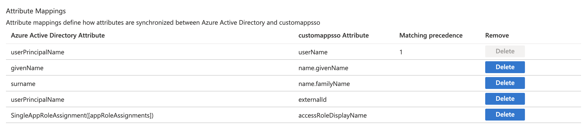

  

<h3 align="center">wmscim</h3>

---

 Few lines describing your project.
      

## 📝 Table of Contents

- [About](#about)
- [Getting Started](#getting_started)
- [Usage](#usage)
- [Deployment](#deployment)
- [TODO](#todo)

## 🧐 About 

The purpose of this project is to take the existing <a href="https://developer.walkme.com/reference#user-management-api">WalkMe User Management API</a> and make it <a href='https://docs.microsoft.com/en-us/azure/active-directory/app-provisioning/use-scim-to-provision-users-and-groups'>a SCIM compliant endpoint</a> to the point where it can be practically used for automated user provisioning in Azure AD.

DISCLAIMER: This is just a POC - it's not perfect, and almost definitely buggy!

Functional gaps that prevent the WalkMe User Management API from being used for automated user provisioning:
 - Implemented a permanent API bearer token, rather than the 24hour token issued by our Get Auth Token API (https://api.walkme.com/accounts/connect/token)
 - Added support for a GET filter query on userName, as Azure uses this for validating the endpoint as a valid SCIM endpoint (and when identifying matching WalkMe users for reconciliation)
 - GET user requests: Extra cell to get AccessRoles and convert the AccessRole ID to the human readable role display name, for matching with App Roles during provisioning
 - PUT/PATCH user requests: Expose a PATCH method rather than a PUT method with an Operations object
 - PUT/PATCH user requests: Extra call to get the user's externalID and submit with the PUT request, as this is required when SSO is enabled (not documented in WalkMe spec)
 - PUT/PATCH user requests: Extra cell to get AccessRoles to accept the human readable role display name as part of a PATCH request and convert it to an Access Role ID for the corresponding PUT request
 - POST user requests: Assign a secure, random throwaway password, as the request fails without one even when account is set up for SSO (not documented in WalkMe spec)

## 🏁 Getting Started 

Grab a copy of the code, make sure you have your WalkMe API credeentials handy, as well as an Azure tenant. The code is just based on Node.JS so it's probably not too hard to pull it out and run it as a standalone Node app with some modification.

### Prerequisites

 - Visual Studio Code with the following extensions:
   - Azure Account
   - Azure Functions
   - Azure Resources
 - A WalkMe MSA account with valid API credentials to the user management API
 - Azure tenant with admin access to manage:
   - Enterprise application registrations
   - Azure Key Vault
   - Azure Functions

### Installing

Download the code and configure your local Azure functions environment.

Verify that your WalkMe API credntials work to <a href='https://developer.walkme.com/reference#getting-started-with-your-api-1'>get you a beaer token</a>.

Note down the Base 64 version of your credentials.

Perform an initial publish of the code to a new Azure Function, note down the endpoint URL.

In Azure, enable your Function App for Identify management, so that it can be managed as an Azure AD resource.

In Azure, <a href='https://daniel-krzyczkowski.github.io/Integrate-Key-Vault-Secrets-With-Azure-Functions/'>set up a new Key Vault</a> with:
 - A secret called `functiontoken` with any random value (this will be used to secure your new SCIM endpoint)
 - A secret called `wmcredentials` with the WalkMe credentiasl as a the base64 encoding of the consumer key and consumer secrect of the WalkMe account joined by a colon.
 - An access policy that allows the GET and LIST functions for Secrets, with your Azure Function App as the service principal

Once created, note down the seccret identfier (URL) for each secret.

In Azure > Function App > Configuration, add your two secrets as application settings:
 - Name: `functiontoken` | Value: `@Microsoft.KeyVault(SecretUri=<your secret identifier URL>`) 
 - Name: `wmcredentials` | Value: `@Microsoft.KeyVault(SecretUri=<your secret identifier URL>`) 

Restart your application

You should now be able to access your SCIM endpoint at  https://\<function app name\>.azurewebsites.net/api/scim/users/

Try a GET call with the value from your `functiontoken` as the Bearer token - you should get back your user list.

## 🎈 Usage 

Supports the following calls:

GET /users (get all users)
GET /users/:user_id (i.e. d133726f-e23d-39e5-423c-0923ds29040)
GET /users?filter=userName+eq+"userName" (i.e. user@company.com)

POST /users (create user)
PATCH /users/:user_id (update user)
DELETE /users/:user_id (delete user)

## 🚀 Deployment 

Once the app is working, you then need to register a new enterprise application (non gallery app). Call it something like "WalkMe Admin User Management". This can manage your user provisioning, as well as your SAML SSO integration for authenticting users.

Once completed, go to App Registrations > \<your app\> > App Roles and add as many user roles as you have in WalkMe. (including any custom ones). Note that the Display Name MUST match the WalkMe role name EXACTLY, as this how user roles are managed.

Next, go to Enterprise Applications > \<your app\> > Provisioning and set up automated provisioning, where your endpoint is your function app endpoint i.e. https://\<function app name\>.azurewebsites.net/api/scim (without the /users part). Your secret token is the secret from `functiontoken`.

You should get a green tick.

Notes:
 - In terms of syncing and scope, I'd suggest syncing only AD users assigned to the all (as opposed to the ALL option). You can use scope to limit further if you want.
 - Syncing Groups is not supported

You then need to update the attribute mappings for AD Users to match the following (you'll need to add the last one as a custom attribute):

Once this is done, you can assign users to your app, and assign them a role and they will be provisioned in WalkMe!

Notes:
 - Supports First Name, Last Name, Principal User Name as mappings
 - Supports assigning the user a WalkMe Access Role as defined in App Registrations > App Roles
 - DOES NOT support assigning systems (yet)
 - DOES NOT support a soft-delete (which occurs when a user is removed from the Azure App, but not removed from Azure AD)
 - DOES NOT support the Groups endpoints

## TODO 

 - Support assigning systems (yet)
 - Support a soft-delete by implementing a pseudo-active status whereby a use is inactivated by removign all of their assigned systems. 
